# Soccer league data ingestion

## Index

1. [Introduction: Soccer League Data Ingestion](#introduction-soccer-league-data-ingestion)
2. [Project Overview](#project-overview)
3. [Key Components](#key-components)
   1. [Google Cloud Setup](#google-cloud-setup)
      - [Enable the YouTube API v3 Service in Google Cloud](#1-enable-the-youtube-api-v3-service-in-google-cloud)
      - [Create an API Key](#2-create-an-api-key)
      - [Restrict Access by IP](#3-restrict-access-by-ip)
   2. [YouTube API Analysis](#youtube-api-analysis)
      - [Using the YouTube API to Analyze Statistics](#using-the-youtube-api-to-analyze-statistics)
4. [AWS Lambda Function](#aws-lambda-function)
   1. [Create S3 Buckets](#1-create-s3-buckets)
   2. [Create the Lambda Function](#2-create-the-lambda-function)
   3. [Add AWS SDK Pandas Layer](#3-add-aws-sdk-pandas-layer)
   4. [Configure Environment Variables](#4-configure-environment-variables)
   5. [Add Python Code](#5-add-python-code)
5. [AWS EventBridge Integration](#aws-eventbridge-integration)
   1. [Create an EventBridge Rule](#1-create-an-eventbridge-rule)
   2. [Associate Rule with Lambda Function](#2-associate-rule-with-lambda-function)
   3. [Testing the Integration](#3-testing-the-integration)
6. [AWS Athena and AWS Glue](#aws-athena-and-aws-glue)
   1. [Create a Data Source in AWS Athena](#1-create-a-data-source-in-aws-athena)
   2. [Set Up AWS Glue Crawler](#2-set-up-aws-glue-crawler)
   3. [Analyze Data in AWS Athena](#3-analyze-data-in-aws-athena)

## Key Components

1. **Google Cloud Setup**
   - The first step is to set up a Google Cloud project and enable the YouTube API v3 service.
   - Follow the steps in [Google Cloud Setup](#google-cloud-setup) to enable the YouTube API, create an API key, and restrict access by IP.

2. **YouTube API Analysis**
   - Utilize the obtained API key to analyze YouTube channel statistics using the provided [Jupyter Notebook file](youtube_stats.ipynb).
   - The notebook includes functions to connect to the YouTube API and retrieve statistics for a specific channel.

3. **AWS Lambda Function**
   - Set up AWS Lambda to automate the daily analysis of YouTube channel statistics.
   - Follow the steps in [AWS Lambda Function](#aws-lambda-function) to create S3 buckets, set up the Lambda function, add necessary dependencies, configure environment variables, and implement Python code for data analysis.

4. **AWS EventBridge Integration**
   - Integrate AWS EventBridge to schedule the execution of the Lambda function daily.
   - Follow the steps in [AWS EventBridge Integration](#aws-eventbridge-integration) to create an EventBridge rule, associate the rule with the Lambda function, and test the integration.

5. **AWS Athena and AWS Glue**
   - Set up AWS Athena to create a data source for analyzing data generated by the Lambda function.
   - Follow the steps in [AWS Athena and AWS Glue](#aws-athena-and-aws-glue) to create a data source in AWS Athena, set up an AWS Glue Crawler to generate a table with information from CSV files, and analyze data in AWS Athena.


## Guide

### Requeriments

- Google Cloud Account
- AWS Account

### Youtube API Credentials

#### 1. **Enable the YouTube API v3 Service in Google Cloud**

Navigate to the [Google Cloud Console](https://console.cloud.google.com/) and follow these steps:

- Open the navigation menu and select "APIs & Services" > "Library".
- Search for "YouTube Data API v3" in the library.
- Click on "YouTube Data API v3" and then click the "Enable" button.

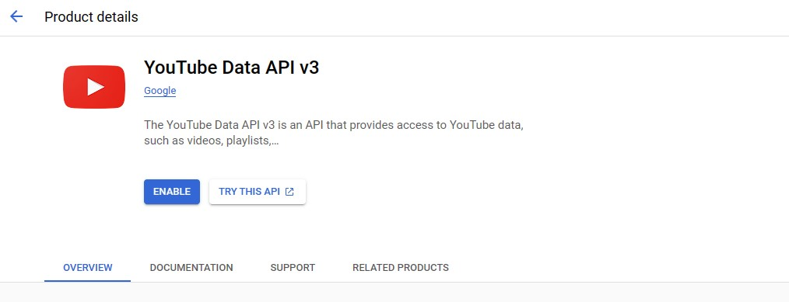

#### 2. **Create an API Key**

After enabling the API, you need to create an API key. Here's how you can do it:

- In the [Google Cloud Console](https://console.cloud.google.com/), go to "APIs & Services" > "Credentials".
- Click on "Create Credentials" and select "API Key".
- Configure usage restrictions according to your needs.

#### 3. **Restrict Access by IP**

   To enhance the security of your application, it's recommended to restrict API key access to only your IP. Follow these steps:

- On the credentials page, find the section for your API key.
- Click on "Edit" to modify the settings.
- In the "API restrictions" section, add your IP address to the list of restrictions.

   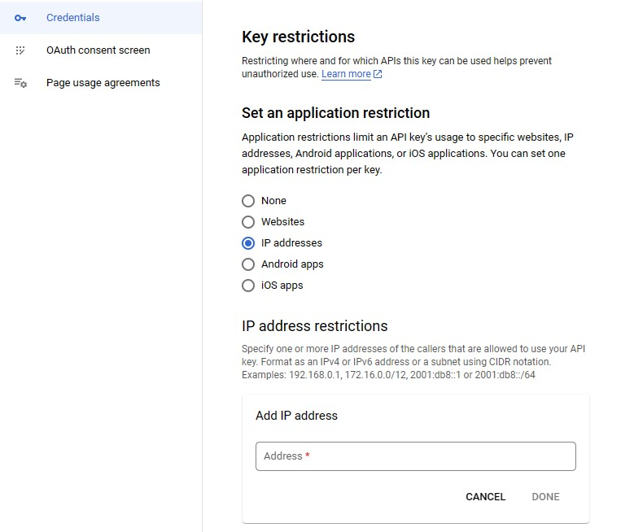

### Using the YouTube API to Analyze Statistics

Now that we have enabled the YouTube API and obtained our API key, we can use it to analyze statistics from a YouTube channel. With the follow [ipynb file](youtube_stats.ipynb). We can go through the conection to the YouTube API using your API key and retrieving statistics for a specific channel.

Inside the file we have the function that calls the endpoint:

```python
def get_stats(api_key, channel_id):
    youtube = build("youtube", "v3", developerKey=api_key)
    request = youtube.channels().list(
        part="statistics",
        id=channel_id
    )
    response = request.execute()
    
    channel_stats = response["items"][0]["statistics"]
    date = pd.to_datetime("today").strftime("%Y-%m-%d")

    data_channel = {
        "Created_at": date,
        "Total_Views": int(float(channel_stats["viewCount"])),
        "Subscribers": int(float(channel_stats["subscriberCount"])),
        "Video_count": int(float(channel_stats["videoCount"]))
    }

    return data_channel

```

And this function creates a dataframe

```python
def channel_stats(df, api_key):
    
    date = []
    views = []
    suscriber= []
    video_count = []
    channel_name = []
    
    
    for i in tqdm(range(len(df)), colour = "green"):
        
        stats_temp = get_stats(API_KEY, df_channels["Channel_id"][i])
        
        date.append(stats_temp["Created_at"])
        views.append(stats_temp["Total_Views"])
        suscriber.append(stats_temp["Subscribers"])
        video_count.append(stats_temp["Video_count"])
        channel_name.append(df["Channel_name"][i])

        
    data = {
        "Channel_name": channel_name,
        "Subscribers": suscriber,
        "Video_Count": video_count,
        "Total_Views": views,
        "created_at": date
    }
    
    df_channels_final = pd.DataFrame(data)
    
    return df_channels_final
```

This is the dataframe:

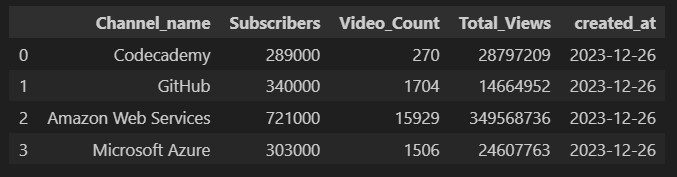

### AWS Lambda Function

#### 1. **Create S3 Buckets**

Create two S3 buckets:

- **Input Bucket (`s3-input-youtube`):** Upload the `channels_to_analyze.csv` file to this bucket.
- **Output Bucket (`s3-output-youtube`):** This bucket will store the daily analysis results.

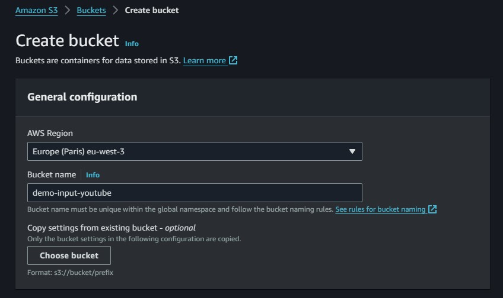

#### 2. **Create the Lambda Function**

- In the AWS Management Console, navigate to Lambda.
- Click "Create function" and choose "Author from scratch".
- Name your function and choose Python 3.10 as the runtime.

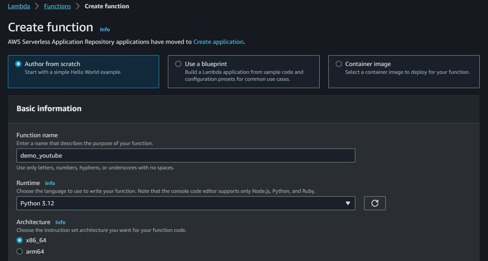

#### 3. **Add AWS SDK Pandas Layer**

- In the Lambda function configuration, add a layer named `AWSSDKPandas-Python310`. This layer includes necessary dependencies.

#### 4. **Configure Environment Variables**

- Set the following environment variables in the Lambda function configuration:
  - `BUCKET_INPUT`: Name of the input S3 bucket (`s3-input-youtube`).
  - `BUCKET_DESTINY`: Name of the output S3 bucket (`s3-output-youtube`).
  - `FILE_CHANNELS`: Name of the CSV file in the input bucket (`channels_to_analyze.csv`).
  - `APIKEY`: Your YouTube API key.

  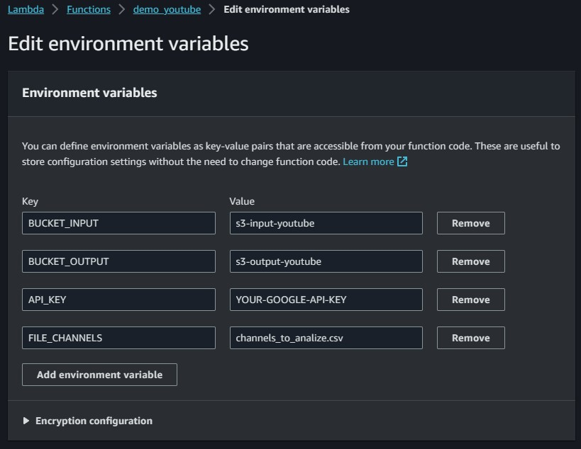

#### 5. **Add Python Code**

Add the following Python code to your Lambda function:

```python
import json
import time
import pandas as pd
import random
import time
import os
from datetime import datetime
import datetime
import requests
import boto3

s3_client = boto3.client('s3')

def get_stats(api_key,channel_id):
    
    url_channel_stats = 'https://youtube.googleapis.com/youtube/v3/channels?part=statistics&id='+channel_id+'&key='+api_key
    response_channels = requests.get(url_channel_stats)
    channel_stats = json.loads(response_channels.content)
    channel_stats = channel_stats['items'][0]['statistics']
    date = pd.to_datetime('today').strftime("%Y-%m-%d")

    data_channel = {
            'Date':date,
            'Total_Views':int(float(channel_stats['viewCount'])),
            'Subscribers':int(float(channel_stats['subscriberCount'])),
            'Video_count':int(float(channel_stats['videoCount']))
   }

    return data_channel

def channels_stats(df,api_key):
    
    date = []
    views = []
    suscriber = []
    video_count = []
    channel_name = []
    
    tiempo = [1,2.5,2]
    
    for i in range(len(df)):
        
        stats_temp = get_stats(api_key,df['Channel_id'][i])
        
        channel_name.append(df['Channel_name'][i])
        date.append(stats_temp['Date'])
        views.append(stats_temp['Total_Views'])
        suscriber.append(stats_temp['Subscribers'])
        video_count.append(stats_temp['Video_count'])
     
    time.sleep(random.choice(tiempo))
    
    data = {
        'Channel_name':channel_name,
        'Subscribers':suscriber,
        'Video_count':video_count,
        'Total_Views':views,
        'Createt_at':date,
    }
    
    df_channels = pd.DataFrame(data)
    
    return df_channels

def lambda_handler(event, context):
    
    bucket_name = os.environ['BUCKET_INPUT']
    filename =  os.environ['FILE_CHANNELS']
    DEVELOPER_KEY = os.environ['APIKEY']
    
    # Get File from S3
    obj = s3_client.get_object(Bucket=bucket_name, Key= filename)
    df_channels = pd.read_csv(obj['Body']) # 'Body' is a key word
    
    
    results = channels_stats(df_channels,DEVELOPER_KEY)
    date = pd.to_datetime('today').strftime("%Y%m%d")
    
    results.to_csv(f'/tmp/youtube_stats_{date}.csv',index = False)
 
    # Send file to  S3
    s3 = boto3.resource("s3")
    
    s3.Bucket(os.environ['BUCKET_DESTINY']).upload_file(f'/tmp/youtube_stats_{date}.csv', Key=f'youtube_stats_{date}.csv')
    os.remove(f'/tmp/youtube_stats_{date}.csv')

    return f'file youtube_stats_{date}.csv send succeded'

```

### AWS EventBridge Integration

#### 1. Create an EventBridge Rule

- In the AWS Management Console, navigate to Amazon EventBridge.
- Click "Create rule" and provide a name and description for the rule (e.g., `automate_youtube_stats`).
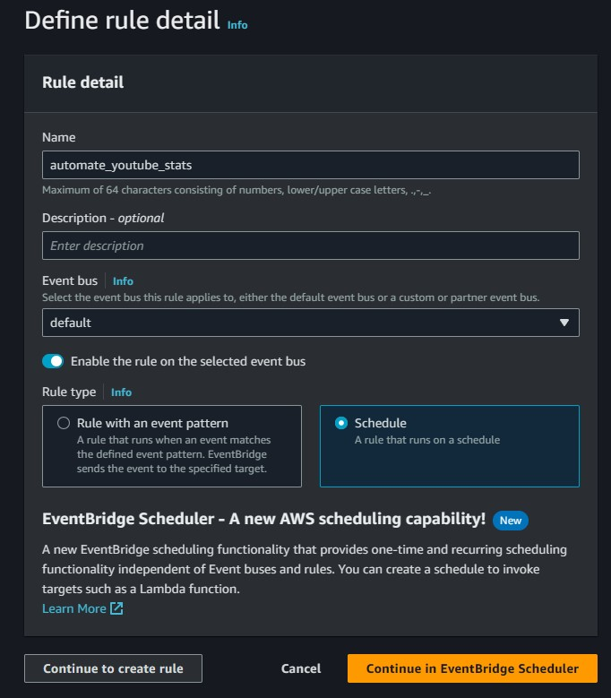
- Set up a recurring schedule for daily execution at 14:30 (2:30 PM).
- The AWS interface will display a table with the days and times of each rule execution.
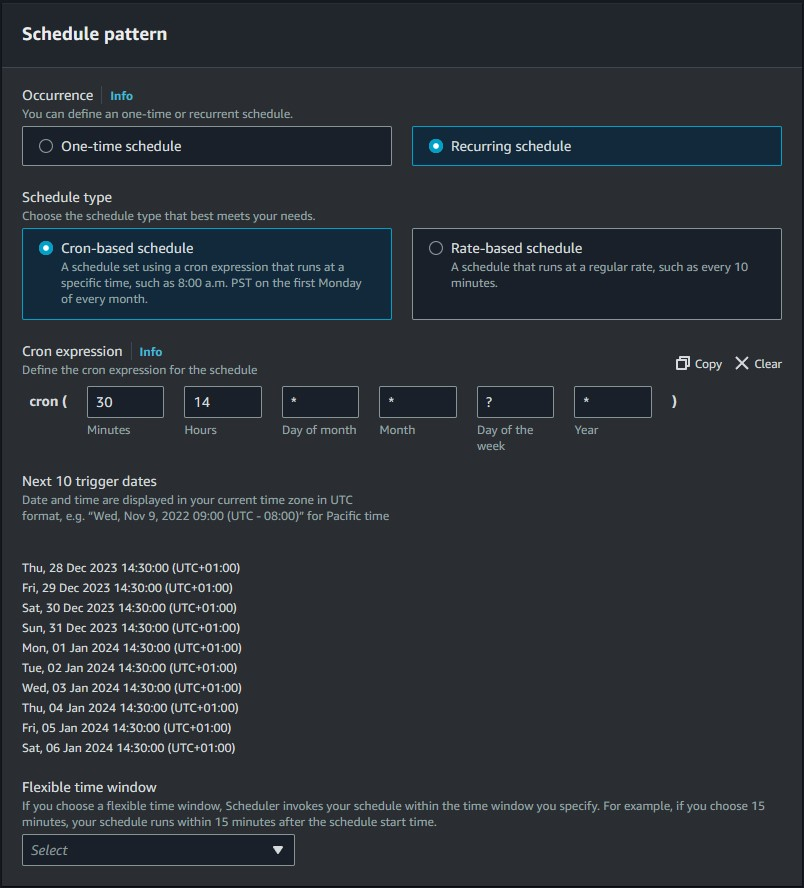

#### 2. Associate Rule with Lambda Function

- After creating the rule, go to your Lambda function in the AWS Management Console.
- In the function configuration, click "Add trigger."
- Choose the trigger source as EventBridge.
- Select the rule you just created (`automate_youtube_stats`).

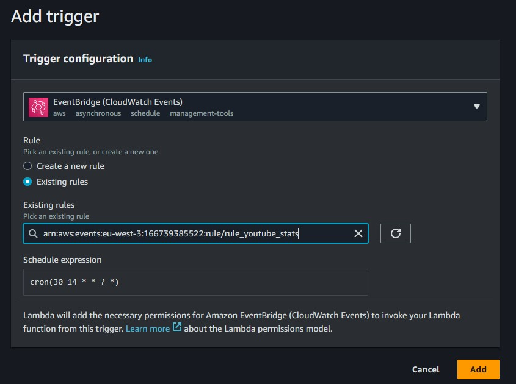

#### 3. Testing the Integration

- Save the Lambda function configuration.
- Ensure that the EventBridge rule is active and scheduled for daily execution at the specified time.

### AWS Athena and AWS Glue

#### 1. Create a Data Source in AWS Athena

- Navigate to AWS Athena in the AWS Management Console.
- Click "Create Table" and choose the data source as AWS Glue Data Catalog.
- Select the Glue Data Catalog as your source and specify your S3 output bucket containing all the CSV files generated by your Lambda function.

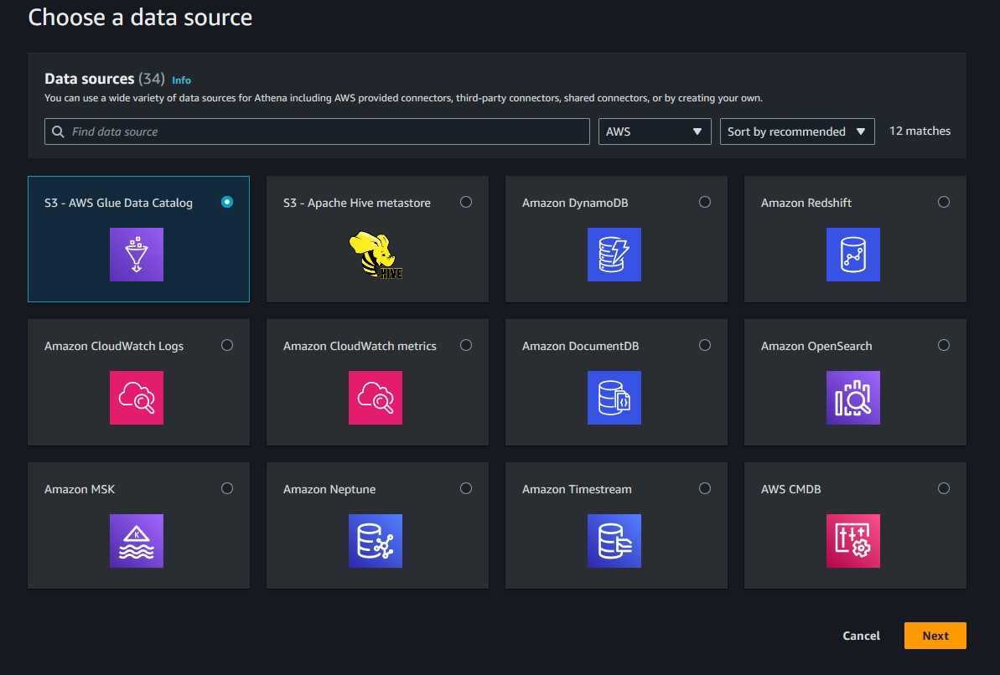

#### 2. Set Up AWS Glue Crawler

- In AWS Glue, create a new Crawler.
- Specify the S3 location where your Lambda function stores CSV files (`s3-output-youtube`).
- Execute the crawler to generate a table with all the information from your CSV files.

#### 3. Analyze Data in AWS Athena

- Once the Glue Crawler has completed its task, go back to AWS Athena.
- You should now be able to run queries and analyze the data using SQL-like queries.
- Utilize Athena to generate views and perform various analyses on the collected YouTube channel statistics.

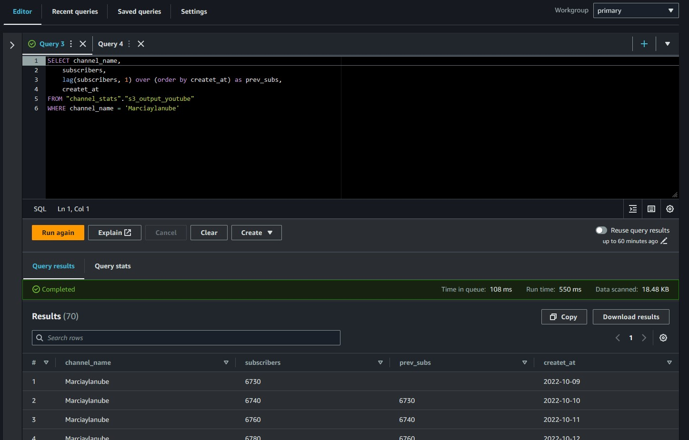

