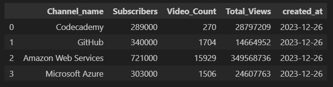

# Introduction: Soccer league data ingestion

TO-DO

# Index

1. [Introduction: Soccer League Data Ingestion](#introduction-soccer-league-data-ingestion)
2. [Project Overview](#project-overview)
3. [Key Components](#key-components)
   1. [TO-DO](#to-do)
      - test
   2. [TO-DO](#to-do-1)
      - test
   3. [TO-DO](#to-do-2)
      - test
4. [Guide](#guide)
   1. [Requirements](#requirements)
   2. [Youtube API Credentials](#youtube-api-credentials)
      - [Enable the YouTube API v3 Service in Google Cloud](#enable-the-youtube-api-v3-service-in-google-cloud)
      - [Create an API Key](#create-an-api-key)
      - [Restrict Access by IP](#restrict-access-by-ip)
   3. [Using the YouTube API to Analyze Statistics](#using-the-youtube-api-to-analyze-statistics)


# Key Components

1. **TO-DO**
   - test

2. **TO-DO**
   - test

3. **TO-DO**
   - test

# Guide

## Requeriments

- Google Cloud Account
- AWS Account

## Youtube API Credentials

1. **Enable the YouTube API v3 Service in Google Cloud**

   Navigate to the [Google Cloud Console](https://console.cloud.google.com/) and follow these steps:

   - Open the navigation menu and select "APIs & Services" > "Library".
   - Search for "YouTube Data API v3" in the library.
   - Click on "YouTube Data API v3" and then click the "Enable" button.

   

2. **Create an API Key**

   After enabling the API, you need to create an API key. Here's how you can do it:

   - In the [Google Cloud Console](https://console.cloud.google.com/), go to "APIs & Services" > "Credentials".
   - Click on "Create Credentials" and select "API Key".
   - Configure usage restrictions according to your needs.

3. **Restrict Access by IP**

   To enhance the security of your application, it's recommended to restrict API key access to only your IP. Follow these steps:

   - On the credentials page, find the section for your API key.
   - Click on "Edit" to modify the settings.
   - In the "API restrictions" section, add your IP address to the list of restrictions.

   

## Using the YouTube API to Analyze Statistics

Now that we have enabled the YouTube API and obtained our API key, we can use it to analyze statistics from a YouTube channel. With the follow [ipynb file](youtube_stats.ipynb). We can go through the conection to the YouTube API using your API key and retrieving statistics for a specific channel.

Inside the file we have the function that calls the endpoint:

```python
def get_stats(api_key, channel_id):
    youtube = build("youtube", "v3", developerKey=api_key)
    request = youtube.channels().list(
        part="statistics",
        id=channel_id
    )
    response = request.execute()
    
    channel_stats = response["items"][0]["statistics"]
    date = pd.to_datetime("today").strftime("%Y-%m-%d")

    data_channel = {
        "Created_at": date,
        "Total_Views": int(float(channel_stats["viewCount"])),
        "Subscribers": int(float(channel_stats["subscriberCount"])),
        "Video_count": int(float(channel_stats["videoCount"]))
    }

    return data_channel

```

And this function creates a dataframe

```python
def channel_stats(df, api_key):
    
    date = []
    views = []
    suscriber= []
    video_count = []
    channel_name = []
    
    
    for i in tqdm(range(len(df)), colour = "green"):
        
        stats_temp = get_stats(API_KEY, df_channels["Channel_id"][i])
        
        date.append(stats_temp["Created_at"])
        views.append(stats_temp["Total_Views"])
        suscriber.append(stats_temp["Subscribers"])
        video_count.append(stats_temp["Video_count"])
        channel_name.append(df["Channel_name"][i])

        
    data = {
        "Channel_name": channel_name,
        "Subscribers": suscriber,
        "Video_Count": video_count,
        "Total_Views": views,
        "created_at": date
    }
    
    df_channels_final = pd.DataFrame(data)
    
    return df_channels_final
```

This is the dataframe:


