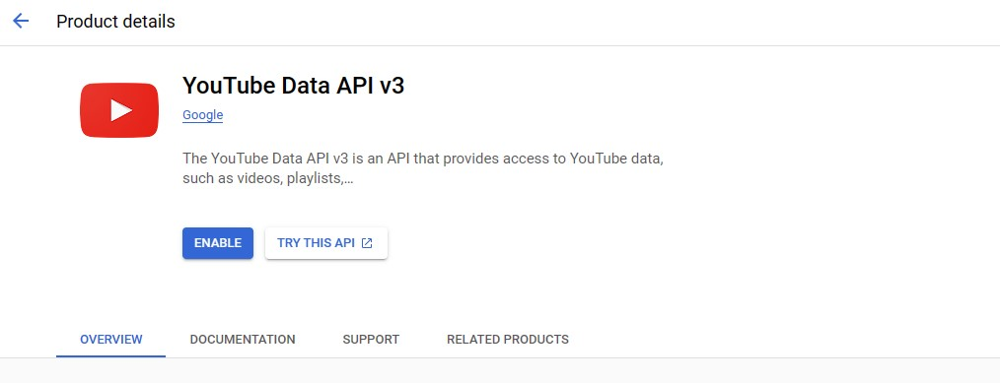
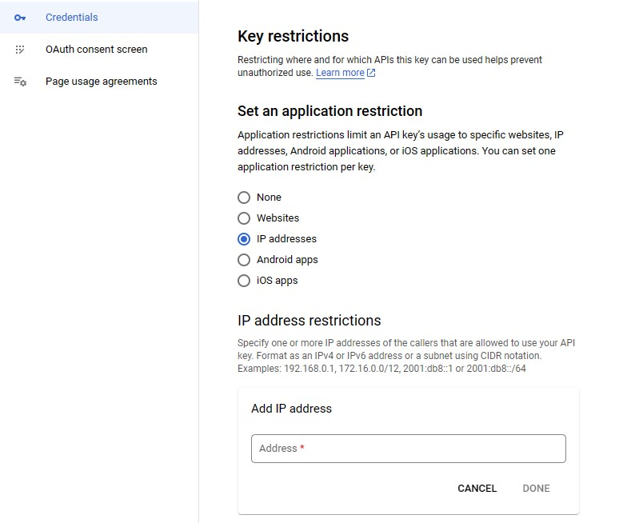

b# Introduction: Soccer league data ingestion

TO-DO

## Project Overview

TO-DO

## Key Components

1. **TO-DO**
   - test

2. **TO-DO**
   - test

3. **TO-DO**
   - test

# Guide

## Requeriments

- Google Cloud Account
- AWS Account

## Youtube API Credentials

1. **Enable the YouTube API v3 Service in Google Cloud**

   Navigate to the [Google Cloud Console](https://console.cloud.google.com/) and follow these steps:

   - Open the navigation menu and select "APIs & Services" > "Library".
   - Search for "YouTube Data API v3" in the library.
   - Click on "YouTube Data API v3" and then click the "Enable" button.

   

2. **Create an API Key**

   After enabling the API, you need to create an API key. Here's how you can do it:

   - In the [Google Cloud Console](https://console.cloud.google.com/), go to "APIs & Services" > "Credentials".
   - Click on "Create Credentials" and select "API Key".
   - Configure usage restrictions according to your needs.

3. **Restrict Access by IP**

   To enhance the security of your application, it's recommended to restrict API key access to only your IP. Follow these steps:

   - On the credentials page, find the section for your API key.
   - Click on "Edit" to modify the settings.
   - In the "API restrictions" section, add your IP address to the list of restrictions.

   

## Using the YouTube API to Analyze Statistics

Now that we have enabled the YouTube API and obtained our API key, we can use it to analyze statistics from a YouTube channel. [provided template](youtube_stats.ipynb). This notebook will guide you through connecting to the YouTube API using your API key and retrieving statistics for a specific channel.
